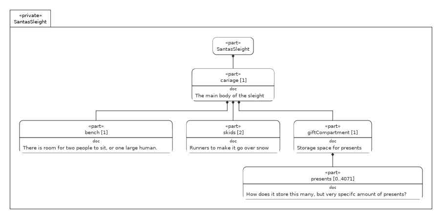

# Advent of SysMLv2 Challenge

This repository contains the challenge tasks and solutions for the Advent of SysMLv2 event.

## Lesson 1

Lesson 1 contains two models:

- a basic version of the christmas tree example
- a solution to the first challenge: santas sleight

### Christmas Tree

[ChristmansTree.sysml](lesson1/ChristmansTree.sysml)

### Santas Sleight

[SantasSleight.sysml](lesson1/SantasSleight.sysml)